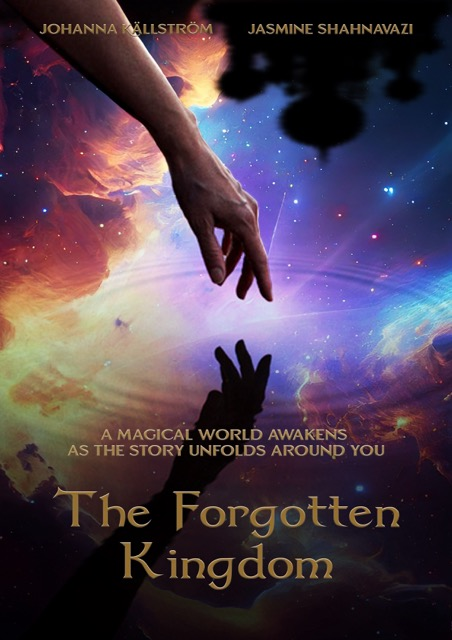
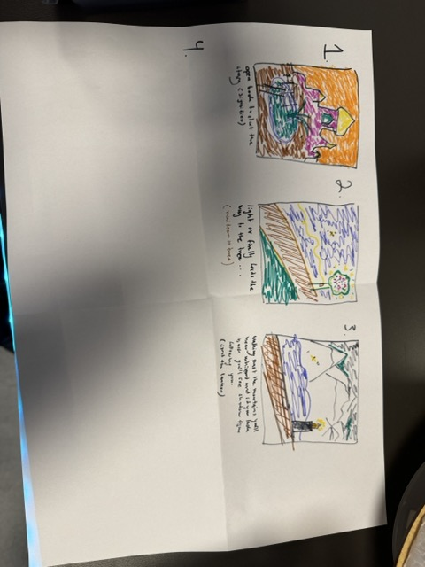
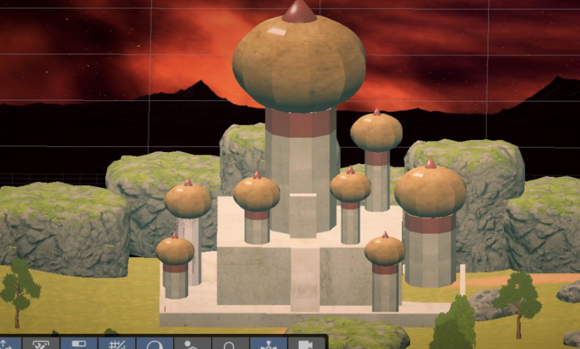
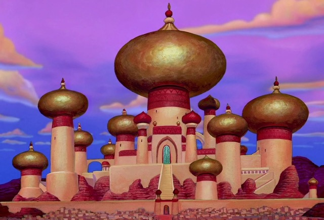
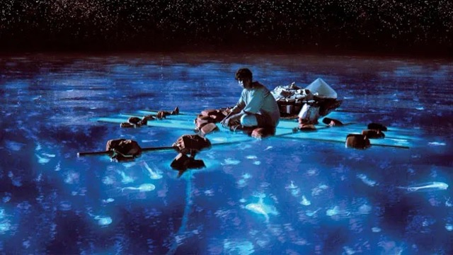

# The Forgotten Kingdom

The Forgotten Kingdom

 

## Introduction

The Forgotten Kingdom is a fun artistic project that lets you explore a world built with magical aspects such as flying sparkling book and a lake that changes when touched. It is a magical kingdom experience built to bring some fun and whimsy into the participants experience.

## Design Process
- Brainstorming: We drew storyboards as our brainstorming method looking up inspiration from movies and pinterest to gather a bigger idea for what we could do.

- A palace was built in Maya to remind of the Aladdin palace but with a different touch.

 

- User Persona: The user persona was more in general people who enjoy the more whimiscal things, such as fantasy stories or more magical elements but we also wanted to make it enjoyable for a broader audience.

- User Journey: The user interacts with buttons that navigate them through the world and takes them on the journey. They will also be able to pick cherries and put them in a basket as a fun side misson on the journey. Lastly they will be ablte to via touch initiate the change of the lake into a more spacy material something that bring together the journey and ends it on a high. The emotions we hope to stir up are nostalgia,fun and maybe a feeling of enchantment.
  

## System description

### Features

- Immersive and realistic 3D models of interactive cherries, a palace built in Maya, a book and an interactive lake. The nature has trees that look realistic with wind, bushes and flowers.
- Interactive and intuitive controls using hand interaction the Meta SDK so everything maps to the gestures of real life.
- Our setting are not necessarliy changable however the audio can be turned up or turned down.
- Compatible with various XR platforms and devices: It is compatible with a few different headsets.

Watch the demo video or try the live version.

Link: <(https://extralitylab.dsv.su.se/project/det/)>

## Installation

To install and run The Forgotten Kingdom on your platform or device, follow the instructions below:

| Platform | Device | Requirements | Commands |
| -------- | ------ | ------------ | -------- |
| Windows  | Meta Quest   | Unity 6000.3.10f1 or higher, Arduino esp32 thing plus| `git clone [https://github.com/user/repo.git](https://github.com/johannakallstrom14/Group4ProjectVR.git)` `cd project-xr` `open NewBuildJas.unity` `Build and Run` |

You also need to install the following dependencies or libraries for your project:

- Packages used - Meta SDK Building blocks, Meta XR All in one, Meta XR Core, Meta XR interaction, XR hands
- ExtralityLab@DSV for websocket

## Usage

To use The Forgotten Kingdom VR and interact with its features, follow the guidelines below:

- To move around,make a room boundary that is at least 3x3 and walk around.
- push the button with hands to start the story and continue.
- Grab the cherries by hand or ray snap interactor to hand.
- To continue the experience push the next button story will keep going
- When arrived at lake touch the lake or move within lake bounds and material will change 
- UI thanking for visiting the kingdom
  
Some tips, tricks, and best practices for using [Your App XR} effectively:

- Tip 1 - Have a well lit room.
- Tip 2 - Have a good mindset.

## References

We were inspired by Aladdin and Life of Pi and wanted to build the world around that vibe. 

  
 

## Contributors
Jasmine Shahnavazi : Gmail: Jasminesh31@gmail.com
Johanna Källström  : Gmail: Johannackallstrom@gmail.com

